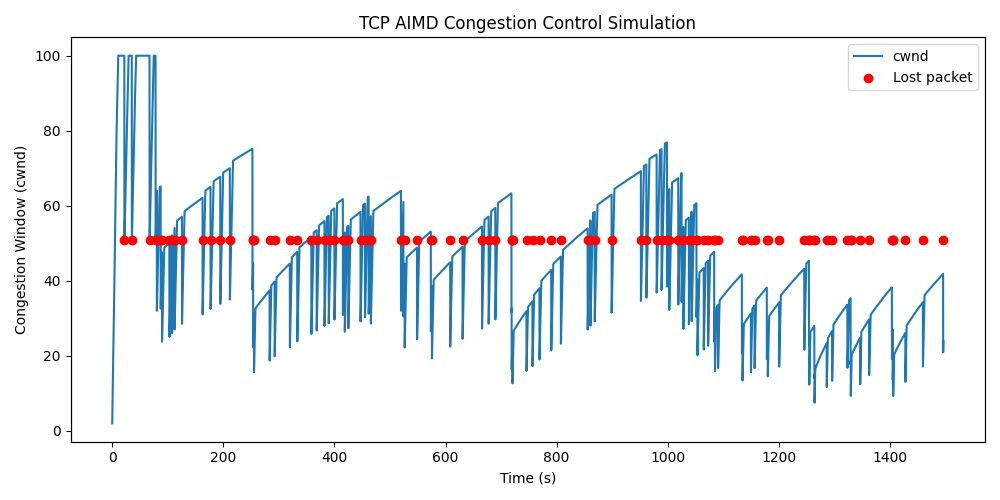
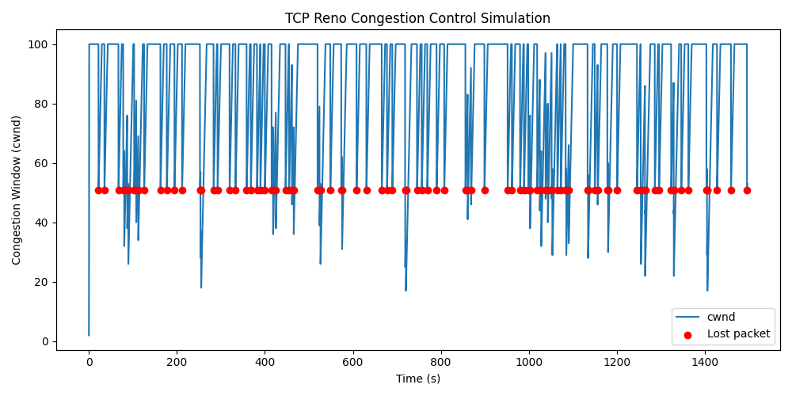
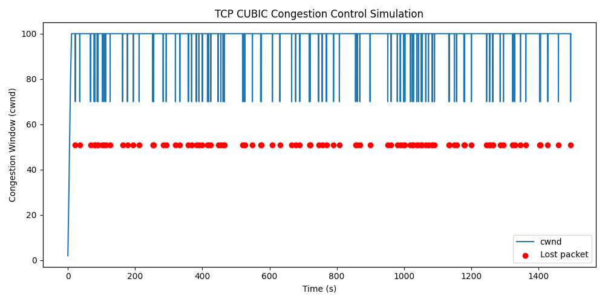

# TCP congestion control

TCP **congestion control** relies on several key algorithms.
Each algorithm is associated with specific formulas governing how the congestion window ($ cwnd $) evolves.
TCP congestion control consists of three primary phases:

- Slow Start (Exponential Increase)
- Congestion Avoidance (Linear Increase)
- Multiplicative Decrease (After congestion is detected)

The traditional way is called **AIMD** (Additive Increase, Multiplicative Decrease), described below.

You can simulate it using the following command, which will generate the image below:
```bash
python simulation.py  --use-aimd --seed 2 --num-acks 10000
```



## Slow Start (Exponential Growth)

- When a TCP connection starts or after a timeout, the congestion window grows exponentially:
  $  cwnd \leftarrow cwnd + MSS  $
  (for each acknowledged segment)

- Alternatively, in terms of round-trip times (RTTs), assuming each RTT doubles the window size:

  $  cwnd = cwnd \times 2  $

- This continues until $ cwnd $ reaches the **slow-start threshold** ($ ssthresh $), after which congestion avoidance takes over.


## Congestion Avoidance (Additive Increase)

- When in congestion avoidance mode, TCP increases $ cwnd $ linearly (per acknowledged segment):

  $   cwnd \leftarrow cwnd + \frac{MSS}{cwnd}  $


- Over one RTT, this leads to (assuming all segments are acknowledged):

  $   cwnd \approx cwnd + MSS  $


## Multiplicative Decrease

- When packet loss is detected (e.g., via triple duplicate ACKs), TCP multiplicatively decreases the window size:

  $  cwnd \leftarrow cwnd \times \beta  $

    where typically $ \beta = 0.5 $ (i.e., **cut window in half**).

- The slow-start threshold is also updated:

  $  ssthresh \leftarrow cwnd  $

- If loss occurs due to a timeout (rather than triple duplicate ACKs), TCP resets:

  $  cwnd \leftarrow MSS  $

  and enters **slow start** again.


## Variations

### TCP Reno

Reno modifies Multiplicative Decrease and part of Congestion Avoidance but not Slow Start.

- Multiplicative Decrease: Instead of reducing $ cwnd $ immediately after triple duplicate ACKs, Reno allows new data transmission:

  $cwnd \leftarrow ssthresh + 3 \times MSS$

  - This keeps the pipe somewhat full.
  - It then enters Fast Recovery, where $cwnd$ increases by MSS per duplicate ACK, preventing an abrupt drop in throughput.

- After receiving a new ACK for new data, Reno switches back to normal congestion avoidance.


You can simulate it using the following command, which will generate the image below:
```bash
python simulation.py  --use-reno --seed 2 --num-acks 10000
```



## TCP CUBIC

TCP CUBIC is a modern alternative to TCP Reno. It is widely used today and it is the default in Linux.
TCP CUBIC introduces a cubic function to control congestion window growth instead of AIMD.

Thus,
- Slow Start: Unchanged (exponential growth).
- Congestion Avoidance: Replaced by a cubic function
This cubic function is:

  $ cwnd = C \times (t - K)^3 + W_{\text{max}} $

where:
- $ C $ is a constant (~0.4),
- $ t $ is the time since the last loss event,
- $ W_{\text{max}} $ is the maximum $ cwnd $ before the last loss,
- $ K = \sqrt[3]{\frac{W_{\text{max}} \times (1 - \beta)}{C}} $.

Growth depends on the time since the last congestion event.
This allows for rapid growth when far from the last congestion event and smoother growth near $ W_{\text{max}} $.

- Multiplicative Decrease: Similar to Reno but tuned for smoother recovery. In TCP CUBIC, the multiplicative decrease step updates $W_{max}$ based on whether the loss occurred under congestion avoidance or an aggressive probing phase.

    - **Basic Multiplicative Decrease** in CUBIC: When packet loss is detected (e.g., through triple duplicate ACKs), CUBIC applies a multiplicative reduction:

        $cwnd \leftarrow cwnd \times \beta$

        where $beta$ is typically 0.7 (unlike Reno’s 0.5). At this point, CUBIC updates $W_{max}$, but how it does so depends on whether the congestion event suggests the network's available bandwidth has increased or not.

    - **Updating $W_{max}$ after Multiplicative Decrease**

        - If the previous congestion window **before loss** was **exactly equal** to $W_{max}$, this means the network may not support such a high rate, so $W_{max}$ is **scaled down** slightly:

            $ W_{\text{max}} \leftarrow cwnd \times (1 + \beta) / 2$

         This reduces $W_{max}$ slightly, preventing overly aggressive future growth.

        - If the loss happened at a lower $cwnd$ than $W_{max}$ (i.e., the network conditions changed and cannot sustain previous rates), CUBIC **fully resets** $W_{max}$:


            $W_{\text{max}} \leftarrow cwnd$

        This prevents CUBIC from blindly assuming the previous peak is still valid.

### Why Does CUBIC Do This?

Unlike Reno, which always cuts $cwnd$ in half, CUBIC uses a more **adaptive** method: (a) If it hits a congestion limit multiple times, it **remembers** that limit and avoids being too aggressive; (b) If the network can handle more traffic, it recovers more aggressively after loss.

This allows faster recovery and better utilization of high-bandwidth networks, which is why CUBIC is used as the default TCP congestion control in Linux.


You can simulate it using the following command, which will generate the image below:
```bash
python simulation.py  --use-cubic --seed 2 --num-acks 10000
```

